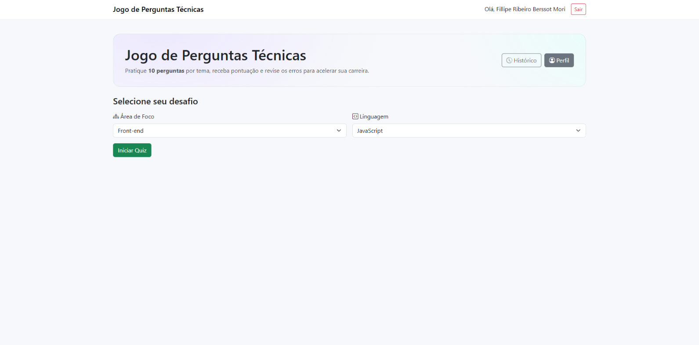
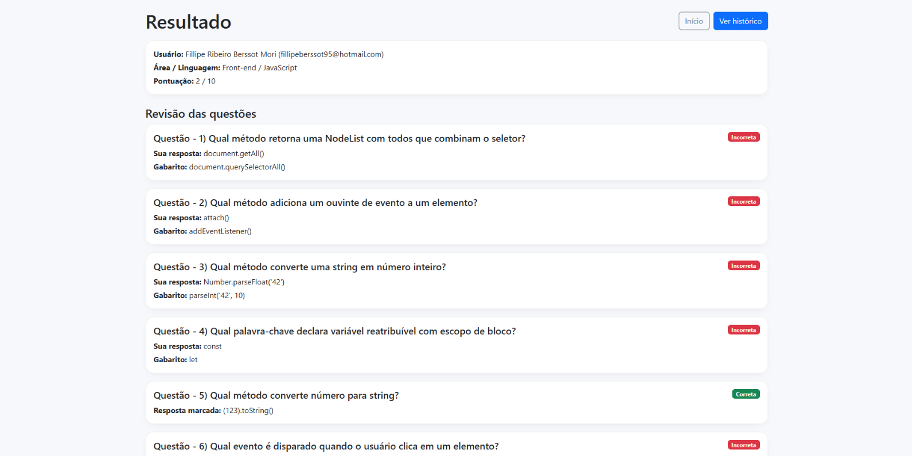
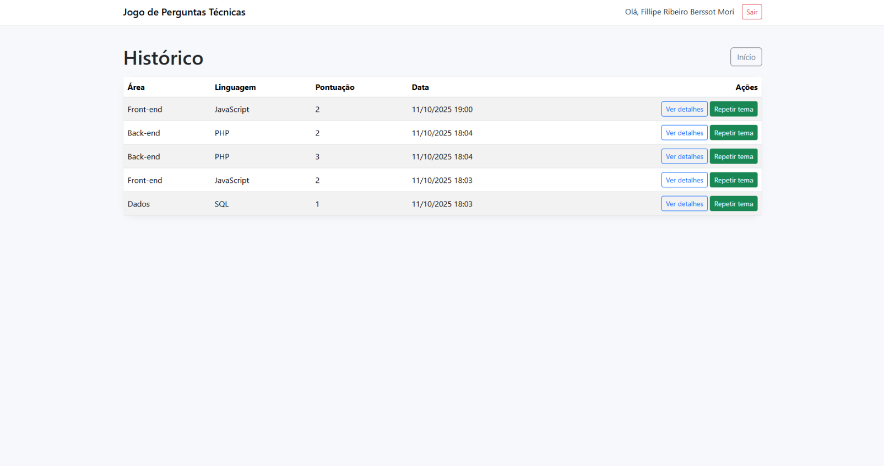

# Jogo de Entrevistas Técnicas (PHP)

Alunos: Fillipe Ribeiro Berssot Mori, Jackson Fabiano Macena Dias Filho

Plataforma web simples e organizada para praticar entrevistas técnicas por meio de quizzes. Ideal para uso acadêmico e estudos individuais.

## ✨ Principais recursos

- **Autenticação** (cadastro, login, logout, perfil com troca de senha).
- **Seleção de desafio** por **Área** (Back-end, Front-end, Dados) e **Linguagem** (PHP, JavaScript, Python, SQL).
- **Banco de perguntas** com **seeds** (20 por combinação suportada).
- **Quiz com 10 questões aleatórias** por tentativa (ordem de questões e alternativas embaralhadas).
- **Envio somente após responder tudo** (validação de formulário + verificação no servidor).
- **Resultado** com pontuação, revisão dos erros e gabarito.
- **Histórico** das tentativas do usuário (com “Ver detalhes” e “Repetir tema”).

> **Obs.**: Projeto acadêmico, sem usuários reais e sem fins comerciais.

---
## 📸 Screenshots

<details>
  <summary><strong>Clique para ver as telas</strong></summary>

  <p>
    
  </p>

  <p>
    
  </p>

  <p>
    
  </p>

  <p>
    
  </p>

</details>

---

## 🧱 Stacks

- **PHP 8+** (servidor embutido para desenvolvimento)
- **SQLite** (via PDO)

---

## 📦 Estrutura de pastas

```
.
├── README.md
├── config/
│   └── config.php
├── data/
│   └── app.sqlite               # gerado pelo seed
├── public/                      # document root
│   ├── assets/
│   │   ├── css/style.css
│   │   └── js/app.js     
│   ├── history.php
│   ├── index.php
│   ├── login.php
│   ├── logout.php
│   ├── profile.php
│   ├── quiz.php
│   ├── register.php
│   └── result.php
├── scripts/
│   └── create_db.php            # cria tabelas e popula seeds
└── src/
    ├── auth.php
    ├── db.php
    ├── questions.php
    └── utils.php
```

---

## ⚙️ Pré-requisitos

- PHP 8+ com extensão **pdo_sqlite** habilitada.
- Permissão de escrita na pasta `data/`.

Verifique rapidamente:
```bash
php -v
php -m | grep -i sqlite
```

Se `pdo_sqlite` não aparecer no Linux:
```bash
# Debian/Ubuntu
sudo apt update
sudo apt install php8.1-sqlite3   # ajuste a versão conforme seu PHP
```

---

## 🚀 Como rodar localmente

1) **Criar banco e seeds**:
```bash
php scripts/create_db.php
```
Caso o comando não funcionar - Crie a pasta data na raiz e rode novamente.
> Isso cria `data/app.sqlite` e popula 20 perguntas por combinação suportada.

2) **Subir o servidor de dev**:
```bash
php -S localhost:8000 -t public
```

3) Acesse em:  
`http://localhost:8000`

---

## 🔐 Fluxo de Autenticação

- **Cadastro** (`register.php`): cria usuário com `password_hash`.
- **Login** (`login.php`): autentica, cria sessão e redireciona.
- **Perfil** (`profile.php`): altera nome e, opcionalmente, a senha.
- **Logout** (`logout.php`): encerra sessão com segurança.

---

## 🧪 Uso do Quiz

- **Combinações suportadas (MVP)**  
  - Front-end: **JavaScript**  
  - Back-end: **PHP, Python, SQL**  
  - Dados: **SQL, Python**
- O quiz sorteia **10 questões** (sem repetição) para a combinação selecionada.
- **Envio só é permitido** quando **todas** as questões foram respondidas (checagem no front e no back).
- Após enviar:
  - Página de **Resultado** com pontuação e revisão (gabarito das incorretas).
  - Tentativa é salva no **Histórico**.

---

## 🛠️ Configurações

Arquivo: `config/config.php`
- **`app_name`**: nome exibido no topo do site.
- Outras chaves podem ser adicionadas caso necessário.

---

## 🗃️ Banco de dados

### Tabelas
- `users (id, name, email, password_hash, created_at)`
- `questions (id, area, lang, enunciado)`
- `answers (id, question_id, texto, correta)`
- `attempts (id, user_id, area, lang, score, created_at)`
- `attempt_answers (id, attempt_id, question_id, answer_id, correta, chosen_text, correct_text)`

### Reset do banco
```bash
rm -f data/app.sqlite
php scripts/create_db.php
```

---

## ➕ Adicionando mais perguntas

1) Edite `scripts/create_db.php` no bloco da combinação desejada e inclua novas questões (1 correta + 3 incorretas).
2) **Resete** e **rode** o seed novamente:
```bash
rm -f data/app.sqlite
php scripts/create_db.php
```

---

## 📄 Licença

Projeto acadêmico.

---
